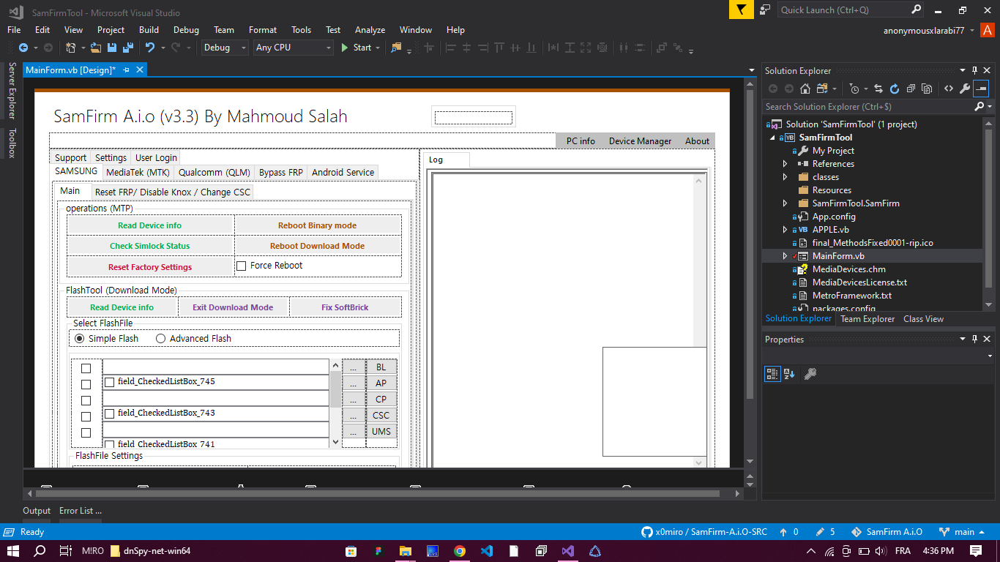

# SamFirm A.I.O v3.3 Source Code

## Overview

SamFirm A.I.O v3.3 is a Samsung firmware management and servicing application developed for Windows.

This repository contains the complete source code of the project and is intended for developers, researchers, and mobile software enthusiasts who wish to study, customize, maintain, or extend the application.

  

## Features

- Samsung firmware download functionality
- Device information tools
- Windows Forms user interface
- Integrated utility modules
- Configurable project structure
- Easy customization and extension

## Source Code Package

This package includes:

- Full Visual Studio solution
- Complete VB.NET source code
- Forms and resources
- Project dependencies
- Build-ready project files

## Requirements

- Visual Studio 2019 or newer
- .NET Framework (according to project version)
- Windows 10 / Windows 11

## Building

1. Open the solution file in Visual Studio.
2. Restore required dependencies.
3. Build the project.
4. Run the generated executable.

## License

This source code is distributed under a commercial license.

### Purchase Price
**$59 USD**

### Allowed

- Personal use
- Educational use
- Modification of the source code
- Building custom versions for personal projects

### Not Allowed

- Redistribution of the source code
- Republishing the source code
- Reselling the source code package
- Claiming authorship of the original project

## Disclaimer

The source code is provided "as is" without warranty of any kind. The author is not responsible for any damages, losses, or issues resulting from its use.

## Contact

For licensing inquiries, support, or business-related questions, please contact the seller.

---

**SamFirm A.I.O v3.3 Source Code**
Commercial Source Code Release
Price: $59 USD
